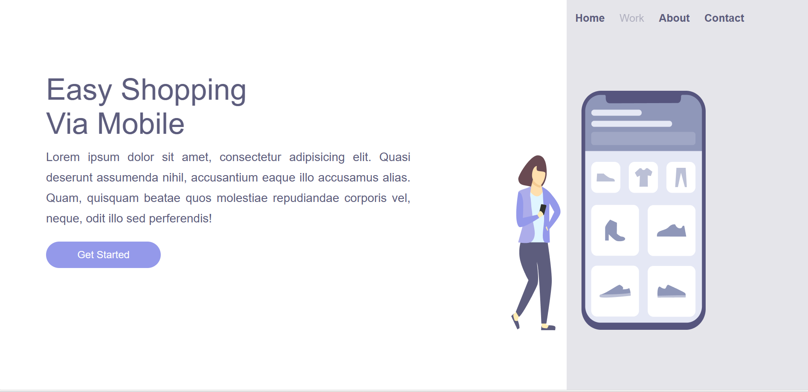

<h1 align="Center"> EASY SHOPPING </h1>

Notbook

 
 

Smartphone

<h4>
Este é um projeto desenvolvido por mim para uma boutique de modas especializadas em roupas e calçados masculinos e femininos, localizada em um shopping. Este projeto se destaca por proporcionar aos clientes uma adaptação do site que permite que os usuários naveguem tanto pelo seu smartphone, quanto pelo desktop. 
 
 
O projeto foi um marco significativo em meus estudos e na minha vida como programadora, pois pude aplicar os conhecimentos aprendidos no <a href="https://rodolfomori.com.br/devclub/" target="_blanck">Devclub.</a>, implementando a responsividade pela primeira vez em um projeto e fazendo com que ele funcione em diferentes dispositivos.

</h4>

### Tecnologias usadas:

- Html
- Css
- Responsividade

